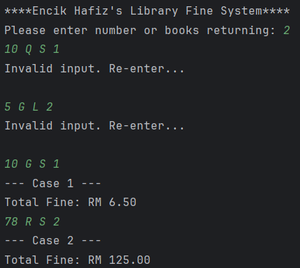

## Problem description 
To encourage responsible borrowing, especially among frequent student borrower, Encik Hafiz introduces an enhanced fine calculation system that is fairer, more flexible, and responsive to different types of borrowing behaviour.

The upgraded system is designed to handle multiple book categories, each with its own fine structure. It also considers how late the item is returned, the borrower’s category (student or staff), and the user’s borrowing history. To ensure fairness, the system includes additional penalties for serious late returns and rewards for responsible borrowers who maintain a good record.

The goal is to design a program that calculates the total fine for multiple test cases based on the following inputs for each borrowed item:
- Days overdue
- Book type (R, G, M, C, T)
- Borrower category (Student or Staff)
- Number of previous late returns

Using these inputs, the program must apply the appropriate fine rates, extra penalties, and eligible discounts following the rules set by the library. The final output for each test case should clearly display the total fine amount with two decimal places.

---

## Solution Explanation 

### 1. Reading the Number of Cases
The program first asks the user how many books are being returned.
A for loop is build to run once for each book so the fine can be calculated individually.

### 2. Collecting Input for Each Case
**For each book, the program reads**
- Number of overdue days: ``days``
- Book type (R, G, M, C, T): ``bookType`` 
- Borrower category (S = Student, T = Staff): ``category``
- Number of previous late returns: ``lateCount``

**Before any calculations, the program checks three conditions**: 
1. Days must be ≥ 0
2. Book type must be R, G, M, C, or T
3. Category must be S or T

**If input invalid**: 
1. Prints “Invalid input. Re-enter…”
2. ``i--`` to repeat the same case
3. ``continues`` to the next loop with same ``i``

### 3. Determine `fineRate`, `penalty` & `price` Using switch(bookType)
``switch`` statement is used to calculate the base fine depending on the ``bookType``

**a. if ``R``**, 
 - direct charge of RM100 regardless of days
 - therefore, 
    * `price = 100.0;` is directly used

**b. if ``G``**, 
`price` can be directly calculated as: 
 - *Tier 1:* Days 1 – 7 → RM 0.50 per day
    * ``price = days * 0.50;``
 - *Tier 2:* Days 8 – 30 → RM 1.00 per day
    * need to consider before 8th day, it is still RM 0.50 per daay 
    * the extra days (days > 7) are charged at RM1.00 per day
    * ``price = (7 * 0.50) + ((days - 7) * 1.00);``
 - *Tier 3:* Days 31 and above → RM 2.00 per day
    * same logic as tier two yet adding one more level 
    * Days 1–7 → RM0.50/day, Days 8–30 → RM1.00/day, Days 31+ → RM2.00/day
    * ``price = (7 * 0.50) + (23 * 1.00) + ((days - 30) * 2.00);``

**c. if `M`**, 
 - flat rate of **RM 0.20 per day**  
 - simple multiplication based on number of overdue days
 - therefore, 
    * `price = ((double) days *fineRate)+penalty;` 
    * `(double)` is used as days is `int` at first

**d. if `C`**,
 - multimedia items use **two levels of charges**  
    * *first 10 days* → RM2.00 per day  
    * *after 10 days* → RM5.00 per day  
 - uses loop or segmented calculation
    * for first 10 loop it will kept adding RM 2.00 into the previous sum
    * for loop after 10 it will kept adding RM 5.00 into the previous sum

**e. `default`**,
- `if` used to determine whether days<10
- if *TRUE* charge RM 10 per day with **NO** `penalty`
- `else` charge RM 10 per day with `penalty` = RM 200
- therefore, 
    * `price = ((double) days *fineRate)+penalty;` 
    * For case `days < 10` : 
        * variable `penalty` still can use as it is declared at first which `double penalty = 0.0; `

### 4. Additional Penalties
Extra penalties `xPenalty` is calculated after `price`

**a. Overdue > 60 days → +RM25**
- The reason ``xPenalty += 25.00;`` is used: 
    * `xPenalty` is declared `double xPenalty = 0.0` above 
    * using `+=` add up the value
    * it is to ensure condition without extra penalty will just safely added by RM 0

**b. Habitual Offender (lateCount ≥ 3) → +RM10**
- ``xPenalty += 10.00;`` is used due to same reason

### 5. Discount Handling (Mutually Exclusive) && Final Price Calculating
- Only one discount may apply.
- The rules are applied in *correct priority order* :
    1. if `T` → 20% discount
        - Staff condition will be considered first
        - Discountec price `discount` is directly counted by declare `discount = 0.80`
    2. else if `(lateCount == 0 && days <= 3)`
        - `&&` to ensure both condition fulfilled 
        - `T` not available for this discount 
        - `discount = 0.50;`
- Final Price post-discount is calculated: `totalPrice = (price * discount) + xPenalty;`

### 6. Output
- `System.out.println("--- Case " + i + " --- ");` 
    * `i` is printed for each loop 
- `totalFine` is printed in 2 decimals

--- 

## Sample input and output

### Sample 1 

### Sample 2

---

## Source code 
See [Q1.java](Q1.java)