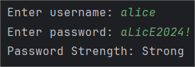
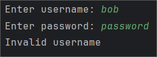

### Problem description
Your friend, Amir, is completing his Final Year Project (FYP), which is a social networking app
for university students called “UniVerse.” Under the supervision of Dr. Hidayah, a
cybersecurity expert, Amir must implement a robust account registration module that
ensures both usernames and passwords meet strict security standards.

Previously, Amir only focused on password strength. However, Dr. Hidayah’s new guidelines
require a two-tier validation process: first for username integrity, then for password security.

### Solution explanation
- Import Scanner to read user input
- Prompt user to enter a username and password

**Validation of username:**
A boolean variable `valid` is initialized as true. Several rules are checked using `if` statements and `for` loop.
- Must start with a letter (A-Za-z): first character (index 0) is read. If it is not uppercase or lowercase letter, `valid = false`.
- Must be 5-15 characters long: if username.length() less than 5 or greater than 15, `valid = false`.
- Can contains letters, digits, or underscores only: since the first character has already been validated,  a `for` loop check for remaining characters. `letter`, `digit` and `underscore` are declared as boolean. If not letter, not digit and not underscore, `valid = false`.
- Must not contain uppercase letters: if uppercase letter is read, `valid = false`.

If any rule fails -> print invalid username message and skip password validation.

**Password Strength:**
If username valid, a variable strength is initialized at 0. Several boolean flags (`uppercase`, `lowercase`, `digit`, `special` and `spaces`) are initialized to false to track which criteria the password meets.
- Minimum 8 characters: if the password.length() greater or equal 8, strength++
- No username as substring: both password and username are converted to lowercase. If password does not contain username as a substring, strength++

**A for loop examines each character**
- At least one uppercase: if an uppercase letter is read, `uppercase = true`, strength++
- At least one lowercase: if a lowercase letter is read, `lowercase = true`, strength++
- At least one digit: if a digit is read, `digit = true`, strength++
- At least one special character: special character(not letter and digit) is read, `special = true`, strength++
- Must not contain any spaces: if a space is read, `spaces = true`, but only strength++ when `!spaces`

**Password rating based on total value of strength**
(if statement)
- strength <= 3 -> weak
- strength <= 5 -> moderate
- strength == 6 -> strong
- strength == 7 ->very strong

### Sample input and output
Sample 1

Sample 2

### Source code
See [Q3.java](Q3.java)
